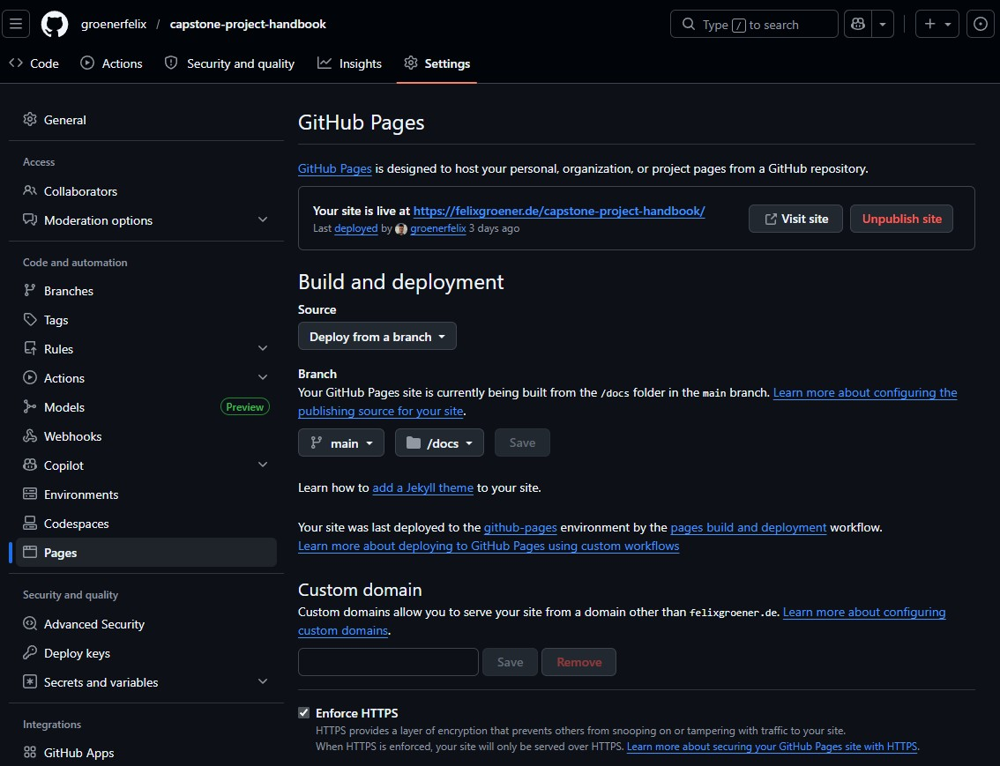

# IFT 401 Capstone Project Handbook

This is an interactive handbook to be handed out to students doing the capstone project (full-stack web application with Python, Flask, Bootstrap, and MySQL; all deployed to AWS). It is written using [MkDocs](https://www.mkdocs.org/).

## Chapters of the handbook:

0. Getting Started
1. Creating Flask Apps
2. MySQL Database Setup
3. Database Integration in Flask Apps
4. CRUD Operations with Forms and Requests
5. Authentication and Access Control
6. AWS RDS Database Setup
7. Deploying to AWS EC2


## Printing to PDF
The easiest way to get a PDF document of a chapter is to open the webpage and print it using the built-in browser function (e.g., `CTRL + P` or right click -> "Print...").

> [!NOTE]
> The `extra.css` file contains some helper classes to control page breaks in prints.
> - Insert `<div class="page-break"></div>` where you want to force a break.
> - Wrap content in `<div class="no-break">...</div>` to avoid splitting it across pages.


## Setup, Development, and Deployment Steps:

### One-time taking ownership and deploying the website

1. On the GitHub repository page, next to the repository title, click "Fork" to copy the repository into your own account.
2. In that new repository that you own, go to "Settings" at the top, then "Pages" on the left, and set up static hosting as shown in the screenshot below.
    - Source: Deploy from branch
    - Branch: Select "main" and click "Save"
3. It might take a minute; then, the manual should be accessible at the URL shown on that settings page. Unless you have set up a custom domain, this will be in the form of `https://<username>.github.io/capstone-project-handbook/`




### One-time setup of a local repository

1. Install and set up python, pip, venv, and git
2. Clone the GitHub repo with `git clone <link-to-repository>` into the desired folder
3. Create a virtual environment `python -m venv venv`
4. Activate venv `venv\Scripts\activate`
5. install requirements `pip install -r requirements.txt`

### Making, previewing, and publishing changes

1. Ensure your virtual environment is set up and active `venv\Scripts\activate`
2. Change directory with `cd` until you are in `src`
3. Start a local live preview in the browser `mkdocs serve --livereload`
4. Edit files in `src/handbook/`: `md` for pages, `.yml` for config, `.css` for styling
5. Save files, then build the website with `mkdocs build`
6. Optionally, print the local page as a PDF and overwrite the outdated one in `/PDFs/`
7. Commit and push your changes
    - move back to the root directory  with `cd ..`
    - add all changed firles with `git add .`
    - commit changes locally with `git commit -m "descriptive message"`
    - publish your changes on GitHub with `git push origin main` 
    - The website should update automatically within about a minute

> [!CAUTION]
> Never edit anything in `/docs/` as it will be overwritten in the build step!


## Regular Markdown

Write documentation in regular markdown.

````markdown
# Title
## Header 1
### Header 2
Regular text, *italicized* and **bold**
```python
code
```
[Link text](link.url)
````
See more like tables, footnotes etc. here: [Markdown cheat sheet](https://www.markdownguide.org/cheat-sheet/)


## Text Boxes

Requires adding `pymdownx.admonitions` to the `mkdocs.yml`. [Documentation](https://squidfunk.github.io/mkdocs-material/reference/admonitions/)

```markdown
!!! info "Details"
    This box holds longer explanations.
```
- `!!!` marks it as a box. Create collapsible boxes with `???+`, or initially collapsed with `???` 
- `info` is the type (determines icon and color); available types: note, abstract, info, top, success, question, warning, failure, danger, bug, example, quote
- `Details` is the title
- the indented text is the content

Boxes can be placed inline with `!!! info inline end`.


## Code Blocks

Add titles and line numbers like this (where 1 is the starting line number):

    ```python title="<custom title>" linenums="1"
    def test():
        pass
    ```

Highlight lines by adding `hl_lines="2 3"` or `hl_lines="2-4"`.

Add buttons for selecting and copying the code in `mkdocs.yml`:

```yml
theme:
    features:
        - content.code.copy
        - content.code.select
```

Code block formatting (especially line numbers) will break if lines are too long. The solution is to change the indentation from tabs to double-spaces, or to manually write lines in a wrapped style. If that is not enough, I have turned off line numbers for that code block

Long code blocks (e.g., > 40 lines) look ugly when printed to PDF. The solution is to break them into smaller code blocks and then start every subsequent codeblock at the correct line number, for example: 

```
python title="app.py (continued)" linenums="19"
```


## In-line Annotations
Requires adding `pymdownx.superfences` to the `mkdocs.yml`. [Documentation](https://squidfunk.github.io/mkdocs-material/reference/annotations/)

    ```python
    def add(a:int, b:int) -> int: # (1)!
        return a + b # (2)!
    ```

    1. `a:int` is the first number. `b:int` is the second number.
    2. The function returns their sum.

The icon can be changed in the config file
```yml
theme:
    icon:
        annotation: material/help-circle
```


## Images and Captions

Images can be inserted like this:

```markdown
{ width="300" }
```

Alternative text and width are optional. Center the image and add an optional caption with the following code:

```markdown
<figure markdown="span">
  { width="300" }
  <figcaption>Image caption</figcaption>
</figure>
```

This needs to be enabled in the `mkdocs.yml` config file.

```yml
markdown_extensions:
  - attr_list
  - md_in_html
  - pymdownx.blocks.caption
```


## Tooltips

Individual tooltios can be created for links:
```markdown
[Hover me](https://example.com "I'm a tooltip!")
```

This needs to be enabled in the `mkdocs.yml` config file.

```yml
theme:
  features:
    - content.tooltips
```


Recurring tooltips can be defined once for every appearance of the word (e.g., abbreviations):

```
The HTML specification is maintained by the W3C.

*[HTML]: Hyper Text Markup Language
*[W3C]: World Wide Web Consortium
```

This also needs to be enabled in the `mkdocs.yml` config file.

```yml
markdown_extensions:
    - abbr
```


