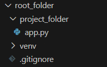

<div class="chapter-nav" markdown="1">

[Home](index.md) |
[Next](chapter-1.md)

</div>


# Chapter 0: Getting Started

## How to read this manual

This handbook provides you with the specific instructions for this project. Because there is such a large number of groups, we cannot allow you to be creative here. You are required to follow these guidelines that make it easier for us to grade your work.

This handbook will teach you everything you need to know to complete the project. You should be familiar with most of it from previous courses.

Between instructions and code snippets you will encounter two types of boxes in this manual.

!!! warning "Important instructions and frequent mistakes"
    Be aware of these.

!!! info "Optional insights"
    Read them if you want to learn more.


## Installing required software

Follow these steps to install the software that you will need in every assignment. You only need to do this once.

### Installing Python

Python is the programming language that you will primarily use in this class.

#### On Windows

1. Open the Microsoft Store app on your computer.
2. Search for "Python" and open the *latest version*.
3. Click "Install".
4. Verify installation by opening Command Prompt and typing: `python --version`.

!!! warning "If this does not work, install Python manually"
    1. Visit [python.org/downloads/](https://www.python.org/downloads/).
    2. Download the *latest version* for Windows.
    3. **IMPORTANT:** During installation, check the box that says 'Add Python to PATH'.
    4. Click 'Install Now' and wait for installation to complete.

!!! warning "'Python is not recognized' on Windows means that Python not added to PATH."
    Reinstall Python following the alternative steps in the box above and make sure to click 'Add Python to PATH'.

#### On Mac

1. Visit [python.org/downloads/](https://www.python.org/downloads/).
2. Download the *latest version* for macOS.
3. Double-click the downloaded `.pkg` file.
4. Follow the installation wizard.
5. Verify installation by opening Terminal and typing: `python3 --version`.

!!! warning "On Mac, you will always type `python3` instead of `python`"


### Installing Visual Studio Code

Visual Studio Code is the integrated developer environment that you will use for this class.

- Download the installer from [code.visualstudio.com](https://code.visualstudio.com).
- Install the application on your computer.
- Install the official Microsoft [Python extension for Visual Studio code](https://marketplace.visualstudio.com/items?itemName=ms-python.python) from the extensions marketplace.


### Installing GitHub Desktop

You will use Git for version management and GitHub for code sharing, collaboration, and deployment.

??? info "What is the difference between Git and GitHub?"
    Git is a local version control system for tracking code changes, while GitHub is one of several cloud platforms that hosts code repositories and add collaboration features. Git comes with the installation of the GitHub Desktop client.

1. Download GitHub Desktop from [desktop.github.com](https://desktop.github.com).
2. Install the application on your computer.
3. If you do not yet have a GitHub account with your ASU email, create one at [github.com](https://github.com).
4. Open the GitHub Desktop and sign in with your GitHub account.


## Setting up your development environment

These are the steps you will repeat for each assignment to set up your project environment.


### Creating the project folder structure

You can create a new folder and navigate to it by typing the following into the Windows command prompt or Mac terminal:

```bash
mkdir assignment_01 # (1)!
cd assignment_01 # (2)!
```

1. `mkdir` stands for "make directory", `assignment_01` can be whatever you want the folder to be named.
2. `cd` stands for "change directory", you have to put the same folder name here as you did in the first line.


### Working in virtual environments

A virtual environment is an isolated Python environment that keeps your project's dependencies separate from other projects. This is essential because different projects may require different versions of the same package. Think of it as a container that holds all the specific tools your project needs without affecting other projects on your computer

??? info "Why use virtual environments?"
    - Keeps project dependencies isolated
    - Prevents version conflicts between projects
    - Makes it easy to share your project with others
    - Allows you to replicate the exact environment on different machine

#### Creating a virtual environment

This command creates a new folder called 'venv' containing a complete Python environment.

```bash
python -m venv venv
```

- Remember to use `python3` instead of `python` if you are on a Mac.
- `-m` stands for "module" and means that the next parameter is the name of the module that will be executed
- the first `venv` is the "virtual environment" module
- the second `venv` can be whatever you want to name your environment.
    
!!! warning "'Permission denied' Error on Mac"
    Use `sudo python3 -m venv venv`.

#### Activating the virtual environment

**Before installing any packages or running your app**, you have to always activate the virtual environment in the terminal that you are using. If you close your terminal, you have to activate your virtual environment again when you reopen the terminal. Keep your terminal open and your virtual environment activated while working on your project.

- **on Windows:** `venv\Scripts\activate`
- **on Mac:** `source venv/bin/activate`

!!! warning "Confirm that the venv is active"
    If the activation was successful, you will now see `(venv)` at the beginning of your command line. If you get an error message, read it carefull. You might be in the wrong directory or have a type in the command.

When you are done working in the environment, you can deactivate it by typing `deactivate`.


### Installing required packages

You will need to install some packages for each assignment. Install packages with the python package manager `pip`.

!!! warning "On Mac, always use `pip3` instead of `pip`!"

```bash
pip install package-name
```

Replace `package-name` with whatever package you want to install

!!! warning "Only install packages while your virtual environment is active!"

??? info "How to verify your package installation"
    You can verify that your installation worked by listing all installed packages with `pip list`. This will likely show more than just the one you installed because a package might install its dependencies as well. For example, installing Flask (which we will introduce in the next chapter) automatically installs dependencies such as Wekzeug and Jinja.

You can usually find documentation and example snippets for these packages at [pypi.org](https://pypi.org/).


### Version control with git

Git allows you to easily trace, synchronize, and revert your changes. Set up a new repository for every project/assignment.

To create a new repository in GitHub Desktop:

1. Click “File”, then "New repository".
2. Select your project folder.

!!! warning "If someone on your team has already created and uploaded the shared repository (see below), click 'Clone repository' instead of 'New repository'."

Whenever you make changes to your code, you will see them listed in GitHub Desktop. When you want to create a snapshot of your current state, you need to commit your changes. In GitHub Desktop,

1. Write a clear, descriptive commit message (e.g., "Add user login functionality" instead of "updates").
2. Click "Commit to main" to save the snapshot locally
3. Click "Push origin" to upload your snapshot to the shared GitHub repository.

If there are any files that you do not want to upload to GitHub, then create a `.gitignore` file in the repository folder (i.e., your project folder). There, enter the name of the folders and files you want to exclude, one per line.

```title=".gitignore"
__pycache__
.env
```

To add collaborators:

1. Go to your repository on [github.com](https://github.com).
2. Click "Settings" and then "Manage access".
3. Click "Invite a collaborator".
4. Enter their GitHub username and send the invitation.

!!! warning "During this class, only one team member can work at a time. Carefully follow the workflow below."

Your workflow in group projects during the class will be:

1. One member creates the repository and pushes the initial code.
2. The next team member pulls the latest version of the code *after the first one is done*.
3. This second team member continues the work and commits changes.
4. The third team member waits until the second one has pushed the final version of their work.

!!! info "This is a very valuable skill to learn!"
    Git and GitHub are used in almost all software development jobs. Use this project as an opportunity to become familiar with them.


### Final folder structure

!!! warning "Your projects are required to have the folder structure below!"
    You can rename the folders (e.g., `assignment_01` instead of `root_folder` or `my_app` instead of `project_folder`). This manual will continue to refer to these as root and project folder.

```bash
root_folder/ # (1)!
├── venv/
└── project_folder/ # (2)!
    ├── .gitignore # (3)!
    └── Your code goes here (e.g., 'app.py')
```

1. The root folder contains everything related to your project.
2. The project folder contains the code of your project and the git repository.
3. The `.gitignore` file is only needed if you want to exclude files when pushing your code to GitHub.

??? info "Understanding this folder structure notation"
    We are going to use the above notation for folder structures throughout this manual. Each line is a file (if it includes a `.`) or a folder. A folder contains all the elements that are directly below it and further indented. The above structure would look as follows in Windows:

    

<div class="chapter-nav" markdown="1">

[Home](index.md) |
[Next](chapter-1.md)

</div>