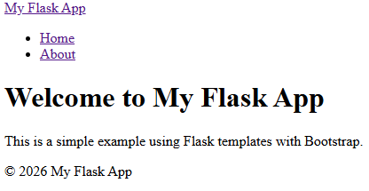
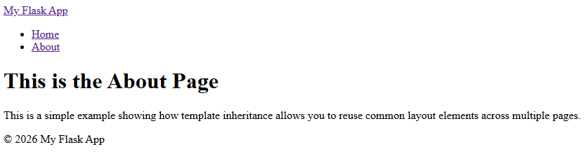
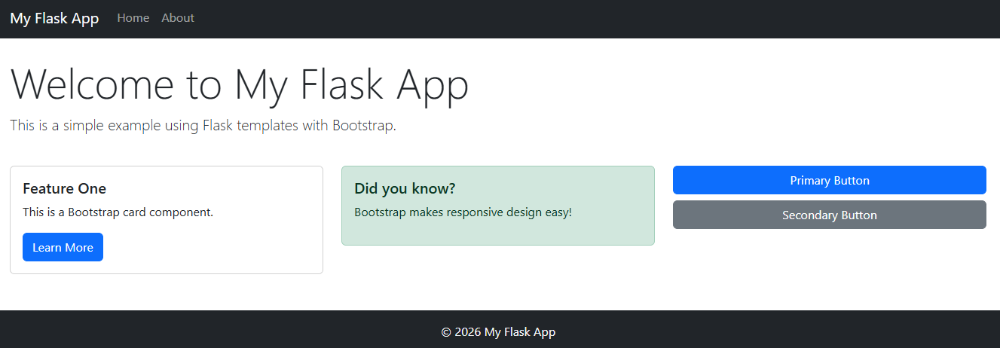

<div class="chapter-nav" markdown="1">

[Previous](chapter-0.md) |
[Home](index.md) |
[Next](chapter-2.md)

</div>


# Chapter 1: Creating Flask Apps

!!! warning "Remember to set up your environment correctly!"
    In the beginning of every chapter, you are required to go through the steps outlined in Chapter 0. Make sure that you have your virtual environment set up and activated!


## Introduction to Flask

### What is Flask?

You will use Flask as a web framework for this project. Flask is a lightweight python package that lets you build web apps and APIs. It is simple to set up and get going because it handles the complicated functions under the hood.

### Installing Flask
Install Flask in your active virtual envionment with `pip install flask`.

You can check whether Flask is installed with `pip list`.

!!! warning "Remember to use `pip3` and `python3` on Macs."

### A minimal Flask application

In your project folder, create a new file called `app.py`.

```python title="app.py"
from flask import Flask # (1)!

app = Flask(__name__) # (2)!

@app.route('/') # (3)!
def hello(): # (4)!
    return 'Hello, World!' # (5)!
```

1. Importing the `Flask` class from the `flask` library
2. Creating an instance of that class and passing it the name of the module. Look up `__name__ in python` for more info.
3. This is a special function added by Flask to indicate which function should be called when someone visits `/` (i.e., the homepage). This parameter can be any route like `/about`. Look up `decorator functions in python` if you are unfamiliar with the `@` notation.
4. Define the function that gets called. You can name this anything but make sure the name is not already taken.
5. This string will be returned to whoever accesses the server. In a browser, this will be rendered as HTML.

Start your app with `flask run`. It should show you in the console what URL you need to type into your browser to access the page (typically [http://127.0.0.1:5000/](http://127.0.0.1:5000/)). This should now display "Hello, World!".

You can stop your app with `CTRL + C` or by closing the terminal.

??? warning "Troubleshooting common issues"
    Carefully read each error message! They often tell you what the problem is, where is occurred, and how to fix it.
    
    - "Flask not found" means that either the virtual environment is not activated or Flask is not installed.
    - "Port 5000 already in use" means that another app is using the port (maybe your own flask app in another terminal!). Close whatever other app is using the port or change the port of your new app with `flask run --port=5001`.


### Debug mode

You can enable debug mode for your application during development by running `flask run --debug`. Never use this in production or submissions!

Debug mode has two advantages for your development process:

- **Hot reload:** It automatically restarts the server when you save changes to your code.
- **Detailed errors:** It shows helpful details in the browser when something goes wrong.


## Working with templates

Templates allow you to separate your Python code from your HTML. Instead of embedding HTML directly in your Python code, you create separate HTML files that Flask renders dynamically. Flask uses **Jinja2**, a powerful templating engine that allows you to include Python-like expressions in your HTML. The Jinja-specific code blocks that differ from standard HTML are indicated by curly braces `{ ... }`. Use:

- `{{ variable_name }}` to print a variable
- `` to execute a code block and print the return value
- `{# comment #}` to add a comment
- ` ... ` to iterate through a list 

??? info "Why use templates?"
    - Separates logic from presentation (cleaner code)
    - Enables template inheritance (no repeat code)
    - Makes it easy to maintain consistent layouts
    - Allows dynamic content insertion


### Project structure

Add a folder which contains your HTML templates. It has to be in this exact location and has to be named `templates`:

```
my_flask_project/
├── venv/
└── my_flask_app/
    ├── .gitignore
    ├── app.py
    └── templates/
        ├── base.html
        ├── home.html
        └── about.html
```

### Base templates

A base template contains the common HTML structure that several (or all) pages share. For example, all pages of your web app will likely have a consistent header and footer. Instead of writing that code multiple times, you will put such shared functionality into a base template. These templates are not full pages and will never be rendered on their own. Other templates extend/inherit these base templates and fill in the placeholder content blocks.

Copy this code into `templates/base.html` and make sure you understand every single line of it:

```html title="templates/base.html"
<!DOCTYPE html>
<html lang="en">
<head>
    <meta charset="UTF-8" />
    <meta name="viewport" content="width=device-width, initial-scale=1.0" />
    <title> - My Flask App</title>
</head>
<body>
    <nav>
        <a href="{{ url_for('home') }}">My Flask App</a>
        <ul>
            <li>
                <a href="{{ url_for('home') }}">Home</a>
            </li>
            <li>
                <a href="{{ url_for('about') }}">About</a>
            </li>
        </ul>
    </nav>
    
    <footer>
        <p>© 2026 My Flask App</p>
    </footer>
</body>
</html>
```

- `...` is a placeholder that will be filled by the child template.
- `{{ url_for('resource_name') }}` is a function that the server will replace with the url like `/about`.


### Template inheritance

Child templates extend the base template and fill in the content block placeholders.

- `` means the child template is using the base template as a starting point.
- `...` fills the placeholder with the content enclosed within the block.

Copy this code into `templates/home.html` and `templates/about.html` respectively and make sure you understand every single line: 

```html title="templates/home.html"


Home


<h1>Welcome to My Flask App</h1>
<p>This is a simple example using Flask templates with Bootstrap.</p>

```


```html title="templates/about.html"


About


<h1>This is the About Page</h1>
<p>This is a simple example showing how template inheritance allows you to reuse common layout elements across multiple pages.</p>

```

Notice how you do not have to write the same code for the navigation links and the footer again for the home and about pages. This saves you time, especially if you want to make changes to that code later.

### Using templates in your app

Now make the following small change to your `app.py` to render and return the HTML code instead of "Hello, World".

```python
from flask import Flask, render_template

app = Flask(__name__)

@app.route("/")
def home():
    return render_template("home.html")

@app.route("/about")
def about():
    return render_template("about.html")
```

The `render_template` function from the Flask package converts Jinja templates into HTML responses. When you now start your app and visit the URL, you should see the simple website. Click on the "about" link at the top to go to the other page.
<figure markdown="span">

</figure>
<figure markdown="span">

</figure>


## Styling with Bootstrap

Bootstrap is a popular library of predefined styles. You will use these styles to quickly make your websites look better.

Bootstrap works by defining utility CSS classes that you can assign to your HTML elements. For example, instead of assigning a class of `dark-mode-paragraph` and then writing its specific styles in a `.css` file, you can use Bootstrap's predefined class names. These class names like `bg-dark text-light mt-5 py-3` are now shortcuts to styling colors, fonts, and spacings (e.g., `mt` = margin top).

!!! info "Find all your style options and premade components at [getbootstrap.com](https://getbootstrap.com/)!"

Your app will retrieve this predefined code from a content delivery network (CDN). This means that your app is telling every browser that visits your website to load someone else's code that you have no control over. This is convenient but can pose a security risk.

Get the link to the latest CSS (styles) and JS (code) from [getbootstrap.com/docs/5.0/getting-started/introduction](https://getbootstrap.com/docs/5.0/getting-started/introduction). These will look something like this:

```html
<link href="https://cdn.jsdelivr.net/npm/bootstrap@5.0.2/dist/css/bootstrap.min.css" rel="stylesheet" integrity="sha384-EVSTQN3/azprG1Anm3QDgpJLIm9Nao0Yz1ztcQTwFspd3yD65VohhpuuCOmLASjC" crossorigin="anonymous">
```

As you can see, you include these external files by linking them just like you would link a local stylesheet. The integrity attribute ensures that the file has not been tempered with. You can visit the link in the `href` attribute to check out the code that you are loading.

Replace the code in `/templates/base.html` and `/templates/home.html` with the following, respectively. It includes the two links you have retrieved from the website and already applies many utility classes to the elements.

```html title="/templates/base.html" hl_lines="6 37"
<!DOCTYPE html>
<html lang="en">
<head>
    <meta charset="UTF-8" />
    <meta name="viewport" content="width=device-width, initial-scale=1.0" />
    <link href="https://cdn.jsdelivr.net/npm/bootstrap@5.0.2/dist/css/bootstrap.min.css" rel="stylesheet" integrity="sha384-EVSTQN3/azprG1Anm3QDgpJLIm9Nao0Yz1ztcQTwFspd3yD65VohhpuuCOmLASjC" crossorigin="anonymous">
    <title> - My Flask App</title>
</head>
<body>
    <nav class="navbar navbar-expand-lg navbar-dark bg-dark">
        <div class="container">
            <a class="navbar-brand" href="{{ url_for('home') }}">My Flask App</a>
            <button class="navbar-toggler" type="button"
            data-bs-toggle="collapse" data-bs-target="#navbarNav">
                <span class="navbar-toggler-icon"></span>
            </button>
            <div class="collapse navbar-collapse" id="navbarNav">
            <ul class="navbar-nav">
                <li class="nav-item">
                    <a class="nav-link" href="{{ url_for('home') }}">Home</a>
                </li>
                <li class="nav-item">
                    <a class="nav-link" href="{{ url_for('about') }}">About</a>
                </li>
            </ul>
            </div>
        </div>
    </nav>
    <div class="container mt-4">
    
    </div>
    <footer class="bg-dark text-light mt-5">
        <div class="container py-3">
            <p class="text-center mb-0">© 2026 My Flask App</p>
        </div>
    </footer>
    <script src="https://cdn.jsdelivr.net/npm/bootstrap@5.0.2/dist/js/bootstrap.bundle.min.js" integrity="sha384-MrcW6ZMFYlzcLA8Nl+NtUVF0sA7MsXsP1UyJoMp4YLEuNSfAP+JcXn/tWtIaxVXM" crossorigin="anonymous"></script>
</body>
</html>
```

```html title="/templates/home.html"

Home

<div class="row">
    <div class="col-md-12">
        <h1 class="display-4">Welcome to My Flask App</h1>
        <p class="lead">This is a simple example using Flask templates with Bootstrap.</p>
    </div>
</div>
<div class="row mt-4">
    <div class="col-md-4">
        <div class="card">
            <div class="card-body">
                <h5 class="card-title">Feature One</h5>
                <p class="card-text">This is a Bootstrap card component.</p>
                <a href="#" class="btn btn-primary">Learn More</a>
            </div>
        </div>
    </div>
    <div class="col-md-4">
        <div class="alert alert-success" role="alert">
            <h5 class="alert-heading">Did you know?</h5>
            <p>Bootstrap makes responsive design easy!</p>
        </div>
    </div>
    <div class="col-md-4">
        <div class="d-grid gap-2">
            <button class="btn btn-primary">Primary Button</button>
            <button class="btn btn-secondary">Secondary Button</button>
        </div>
    </div>
</div>

```

With this code your homepage now looks like this:
<figure markdown="span">

</figure>


??? info "If you like Bootstrap, you might want to check out its Python package for future projects"
    Injecting the Bootstrap styles through Python, Flask, and Jinja can make parts of your code a little bit cleaner. You can look into it at [bootstrap-flask.readthedocs.io](https://bootstrap-flask.readthedocs.io/en/stable/). For this class, you are required to use the CDN link instead of the Python package.


## Adding custom static files (CSS & JavaScript)

If you ever need to add additional styling instructions or client-side code that is not included in Bootstrap, then you can link custom `.css` and `.js` files.

Create the following two files in new folder and place the code below into them. Your final folder structure should look like this. The new folders and files should be named and placed exactly like this:

```
my_flask_project/
├── venv/
└── my_flask_app/
    ├── .gitignore
    ├── app.py
    ├── templates/
    │   ├── base.html
    │   ├── home.html
    │   └── about.html
    └── static/
        ├── css/
        │   └── style.css
        └── js/
            └── script.js
```

```css title="static/css/style.css"
/* Custom styles */
body {
    min-height: 100vh;
    display: flex;
    flex-direction: column;
}
.container {
    flex: 1;
}
footer {
    margin-top: auto;
}

/* Card hover effect */
.card {
    transition: transform 0.2s;
}
.card:hover {
    transform: translateY(-5px);
    box-shadow: 0 4px 8px rgba(0, 0, 0, 0.1);
}
```

```javascript title="static/js/script.js"
// Highlight active navigation link
document.addEventListener('DOMContentLoaded', function() {
    const currentLocation = window.location.pathname;
    const navLinks = document.querySelectorAll('.nav-link');
    navLinks.forEach(link => {
        if (link.getAttribute('href') === currentLocation) {
            link.classList.add('active');
        }
    });
});
```

Then, link the custom static files in your html templates. Using the following variables ensures correct paths regardless of where your app is deployed.

- `<link rel="stylesheet" href="{{ url_for('static', filename='css/style.css') }}">` in the `head` of your template.
- `<script src="{{ url_for('static', filename='js/script.js') }}"></script>` at the end of the `body` of the template.

You can include them in the specific child template if only that one needs it or in the base template if all pages need it. Note that you can only overwrite the default Bootstrap css/js if the link to your custom file comes *after* (i.e., in any line below) the linked Bootstrap code.


<div class="chapter-nav" markdown="1">

[Previous](chapter-0.md) |
[Home](index.md) |
[Next](chapter-2.md)

</div>