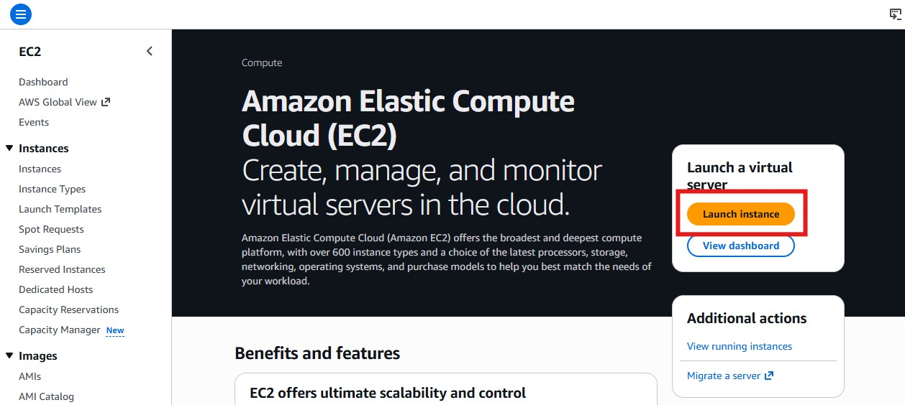
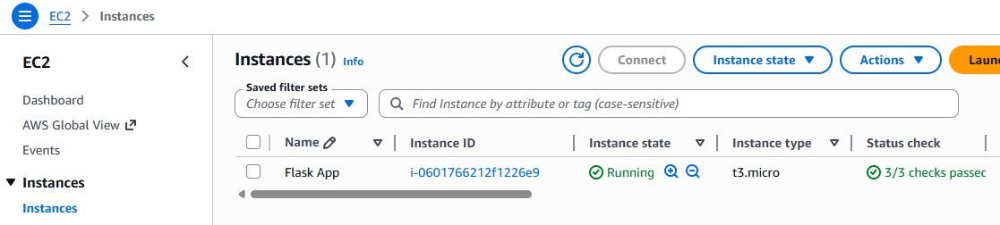
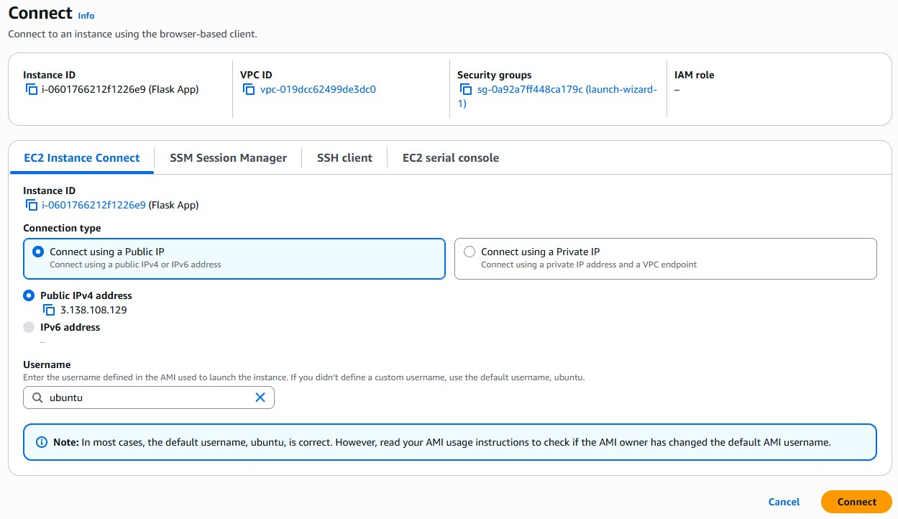
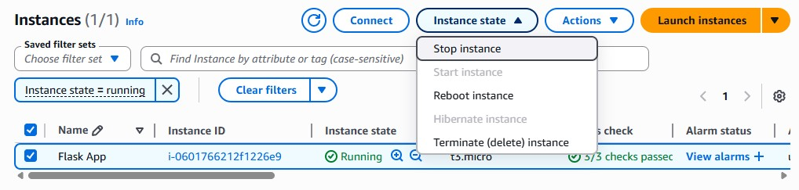

<div class="chapter-nav" markdown="1">

[Previous](chapter-6.md) |
[Home](index.md)

</div>

# Chapter 7: Deploying to AWS EC2

In this final chapter, you will move your Flask application to the cloud, set up firewalls, and connect it to the database. 

!!! warning "Go through the steps of the previous chapter again to set up a fresh database."

## Launching an EC2 instance

Amazon EC2 (Elastic Compute Cloud) provides virtual servers to host your Flask application. 

1. Log in to the AWS Management Console  
2. Search for "EC2" or navigate to "Compute" -> "EC2".
3. Click "Launch instance" at the top

<figure markdown="span">

</figure>

Go through the configuration setup and make selections exactly as follows. If something is not mentioned here you should leave the default value.

- Name: `Flask App` or any name that you will recognize in your AWS dashboards
- Amazon Machine Image: Click "Ubuntu" and then select the latest "Ubuntu Server" version that is "Free tier eligible"
- Instance type: t3.micro (Free Tier eligible)
- Key pair: For this class, select "Proceed without a key pair". 
- Firewall: Select "Create a security group" because this instance will require different firewall rules than the database instance.
- Leave the checkmark ticked for allowing SSH access from anywhere (0.0.0.0/0). You will update the rules in the next step.
- "Summary" on the side:
    - Number of instances: 1
    - Review your settings
    - Click "Launch instance"

!!! warning "Some settings for this class project unsafe for simplicity. In real-world projects you should handle these differently!"
    - Set a key pair
    - Restrict SSH access to only your IP address(es)

It might take a while for your instance to launch. Wait in the EC2 dashboard under the "Instances" tab until your instance has the "Running" state.

<figure markdown="span">

</figure>

Once the instance is ready, select it and take note of its "Public DNS". This is the browser URL to access the server as a visitor.


## Configuring the firewall

You will need to change the firewall settings of your EC2 instance. In AWS, go to "EC2" and then "Security Groups". Change the inbound rules for the group that was created when you created your EC2 instance:

- Keep SSH (port 22) from anywhere (0.0.0.0/0). You need this to log into the server.
- Allow Custom TCP (port 5000) from anywhere (0.0.0.0/0). This is the port through which browsers send requests to your flask application. You will set it later when running `flask run --port 5000`.

!!! info "Limiting the number of ports and the number of accepted sources to a minimum increases security."
    For example, it would be best to set the SSH to only accept requests from your personal IP and the database to only accept requests from the EC2 instance. For simplicity, leave both as "from anywhere (0.0.0.0/0)" for this class so that you can still connect from multiple devices, WiFi spots, and with MySQL Workbench.

!!! info "Real production servers use **reverse proxies** like Nginx or Caddy to route ports 80 (HTTP) and 443 (HTTPS) internally to the right services."


## Connecting via SSH

You can log into the server through your terminal. AWS offers a convenient browser feature for this.

1. In the list of EC2 instances, select your instance.
2. At the top, click "Connect"
3. Select the "EC2 Instance Connect" tab.
4. Choose "Connect using a Public IP"
5. Click "Connect" at the bottom

<figure markdown="span">

</figure>


## Setting up your server and production environment

Once you are connected to the instance, run the following commands.

Update system packages:

```bash
sudo apt update
sudo apt upgrade -y
```

Install Python, pip, and Git:

```bash
sudo apt install python3 python3-pip python3-venv git -y
```

Verify installation:

```
python3 --version
pip3 --version
git --version
```

!!! warning "Note that if you use Windows, you will have to type `python3` instead of `python` because you are now working on a Linux machine."


## Preparing your application

Choose any application that you have built in one of the previous chapters that 

- makes any changes to the database and
- renders a template.

Open that folder and activate the virtual environment.

Change the database connection string to the one you build with the details of the new database you set up for this chapter.

!!! warning "You will likely run into errors if you try to re-use the database from the previous chapter because the User model might be different!"
    Delete the old database and create a new one following the same steps.

Write all required packages into a file called `requirements.txt` with the following command:

```bash
pip freeze > requirements.txt
```

The new `requirements.txt` file now includes all the packages you have installed in this environment, and their specific versions (for example, `bcrypt==5.0.0`). This will make it easier to recreate the same environment on the server.

Commit this new file to the repository and push it to GitHub. Make sure the GitHub repository is public. Copy the URL of that repository (something like `https://github.com/your-username/your-flask-repo.git`) because you will need it for the next step.


## Setting up your application

On the Linux server, clone your directory by pasting the repository URL into the `git clone` command:

```bash
git clone https://github.com/your-username/your-flask-repo.git
```

Navigate into the directory with `cd` followed by the name of your repository:

```bash
cd your-flask-repo
```

Set up a virtual environment:

```bash
python3 -m venv venv
```

Activate your virtual environment:

```bash
source venv/bin/activate
```

!!! warning "Note that if you use Windows, you will have to use the `source` variant of this command because you are now working on a Linux machine."

Install all necessary packages. The command below reads them from the `requirements.txt` file.

```bash
pip3 install -r requirements.txt
```


## Starting and accessing your application

Start your Flask server on the Linux machine:

```
flask run --host 0.0.0.0 --port 5000
```

Your Flask application is now running and accessible from anywhere! Find its public DNS in the EC2 instances list, open a new browser tab and navigate to `http://your-ec2-public-dns:5000`. You should now see your website. Add a user, check the terminal for error messages, and verify that it worked by finding the new entry in MySQL Workbench.

!!! info "`https://` will not work because it requires additional setup"

Just like on your local machine, the server stops and your website becomes unavailable once you close your terminal / the EC Instance Connect page. Avoid this issue by following these steps:

1. Install and use 'screen': `sudo apt install screen`
2. Type `screen` to start a new screen session. 
3. Press space or return to skip the info popup.
4. Run your Flask app
5. "Detach" the session by pressing `CTRL+A` and then pressing `D`.

Your app will now continue to run even when you close the EC Instance connect tab.

To actually stop the Flask application:
- "Re-attach" the session by typing `screen -r`
- Stop the server with `CTRL+C`


## Stopping, restarting, and deleting your instances

Just like databases, running instances will create costs when your free plan expires. At the top of the EC2 instances list, select one and click "Instance state" to see your options.

<figure markdown="span">

</figure>

You can stop an instance temporarily when it is not in use and restart it when you need it. This drastically reduces the running costs.

If you are absolutely sure that you no longer need an instance you can "terminate" the instance permanently. This removes all the data you had saved on it and cuts all costs. 


<div class="chapter-nav" markdown="1">

[Previous](chapter-6.md) |
[Home](index.md)

</div>